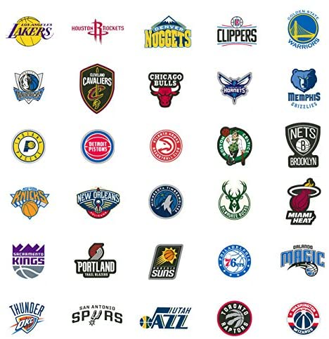
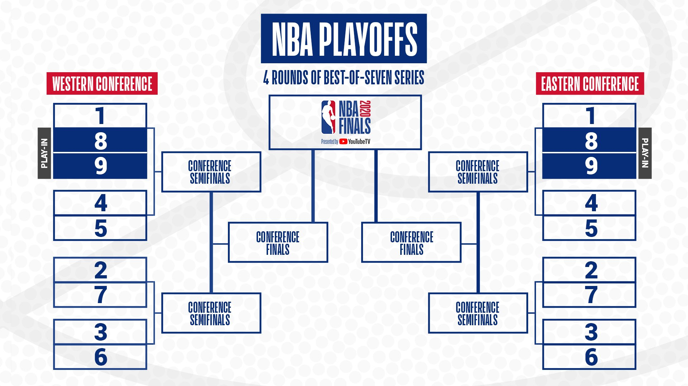
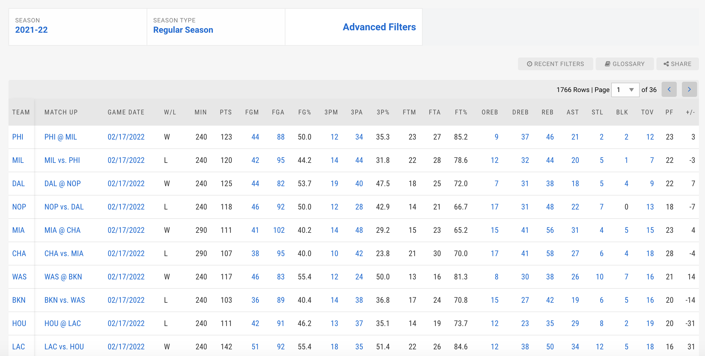

<html>
  
<h1>
<a id="intro" class="anchor" href="#intro" aria-hidden="true"></a>NBA Predictor</h1>
  
<body>

<h3>
<a id="intro" class="anchor" href="#intro" aria-hidden="true"></a>Introduction & Background</h3>

For our project, we aim to predict which teams will make the NBA playoffs and are likely to win the championship based on mid-season performances as well as advanced statistical models. The NBA consists of 30 teams split into 2 conferences where 8 out of 15 teams in each conference advance to the playoffs. Our proposed model will help predict the final NBA standings for the regular season and make predictions regarding the playoffs. The dataset we will primarily use is <a href="https://www.nba.com/stats/teams/boxscores/"> NBA Box Scores </a>  which contains box score stats for every game so far this season as well as for previous seasons.

  

    
    

<h3>
<a id="problem_definition" class="anchor" href="#problem_definition" aria-hidden="true"></a>Problem Definition</h3>

By creating this model, we provide predictions regarding the trajectory of how teams have played so far, and whether they can make the postseason and help predict how the playoff bracket will unfold by running simulations on playoff matchups. The model can also provide bettors and fans with important information to guide wagers or pick teams to support.  

    

  
 <h3>
<a id="methods" class="anchor" href="#methods" aria-hidden="true"></a>Methods</h3>

Below is a snapshot of the box score dataset we have access to. 

    

We would divide the data such that y represents win/loss for each game, and the initial X represents all other game statistics (eg. field goals attempted (FGA), 3-point percent (3P%), total points (PTS) etc). We will run **unsupervised** k – means clustering with k = 2, and some combination of the game statistics as the features. We will repeat this process with a different combination of features each time until we determine the optimal set of features that maximize the correlation between the two clusters and wins/losses. In other words, we want our two generated clusters to correspond strongly to the W/L column and find the corresponding set of optimal features that accomplishes this.

 

Based on the optimal set of features, we can use <b>supervised learning</b> models like logistic regression or decision trees to predict how team A will perform against team B. for each of these methods we can calculate accuracy to see which model works best.

Using the model above, we can predict the total number of games each team would win out of their remaining regular season games and create final standing. We can repeat the process for each playoff matchup until we find a winner. We can also test our model on known results from previous years but running it on the regular season box scores and comparing our predictions to actual outcomes. 

  
<h3>
<a id="results" class="anchor" href="#results" aria-hidden="true"></a>Potential Results and Discussion</h3>

Our model should be able to compare 2 teams playing against each other and predict who will win that game, and be able to compare multiple teams and predict the overall standings of all teams for playoffs. This is essentially the NBA playoffs bracket predicted by our model. Alternatively, we could use ranges instead of definite placings to allow for a little more flexibility (predicting “Top 2”, “Bottom 2” rather than predicting an exact placing between 1 - 2). This way, we could have a better starting point for our results, and can fine-tune our parameters accordingly. Our expected accuracy is approximately 70% for exact placings, and approximately 90% for ranges.

<h3>
<a id="refs" class="anchor" href="#refs" aria-hidden="true"></a>References</h3>
  
1. Mikołajec, Kazimierz et al. “Game Indicators Determining Sports Performance in the NBA.” Journal of human kinetics vol. 37 145-51. 5 Jul. 2013(<a href="https://www.ncbi.nlm.nih.gov/pmc/articles/PMC3796832/">link</a>)
  

  
 2. Thabtah, F., Zhang, L. & Abdelhamid, N. NBA Game Result Prediction Using Feature Analysis and Machine Learning. Ann. Data. Sci. 6, 103–116 (2019) (<a href="https://doi.org/10.1007/s40745-018-00189-x">link</a>)
  

  
 3. Jingru Wang and Qishi Fan 2021 J. Phys.: Conf. Ser. 1802 032036 (<a href="https://iopscience.iop.org/article/10.1088/1742-6596/1802/3/032036">link</a>)
  

<h3>
<a id="timeline" class="anchor" href="#timeline" aria-hidden="true"></a>Proposed Timeline</h3>
  
View our proposed project timeline <a href="https://gtvault-my.sharepoint.com/:x:/g/personal/kcolaco3_gatech_edu/Ed745itnB4BNrrMAhuP-s-cBbbwPmu2WzhvwIJb2FZzEMQ?e=TfflJm/"> here </a>

  </body>
</html>
