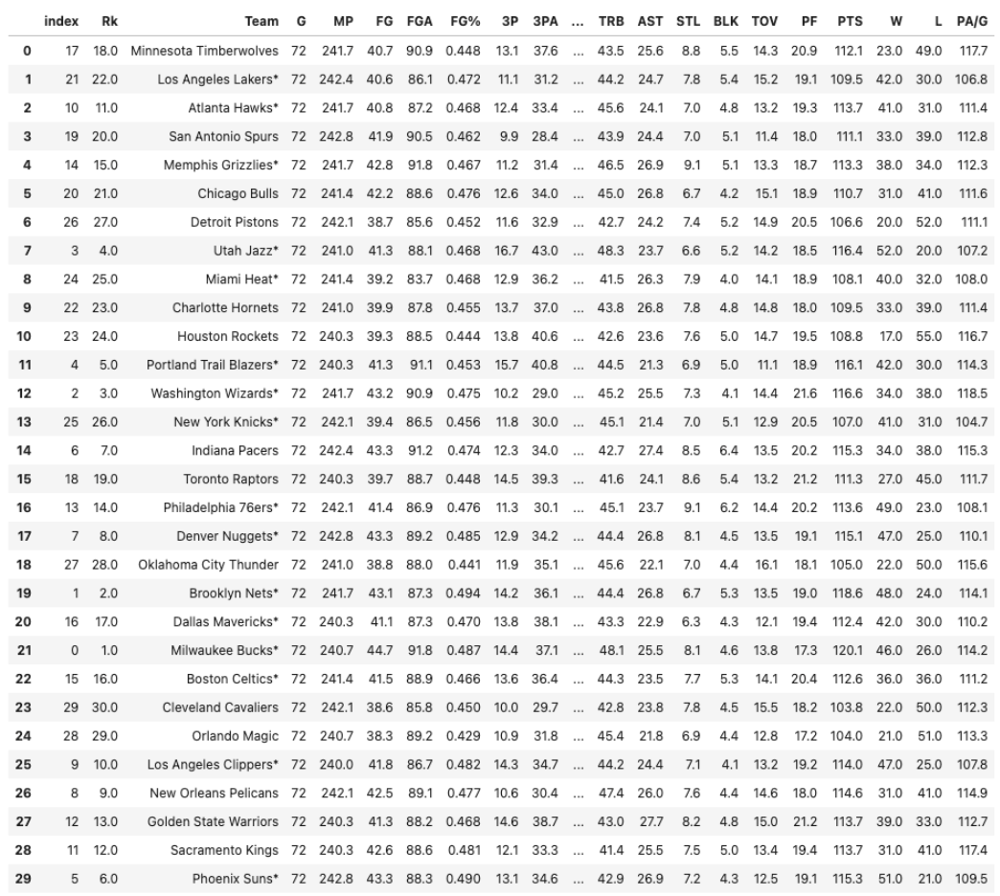
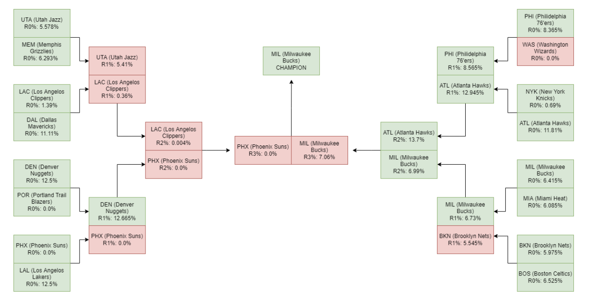

<html>
  
<h1>
<a id="intro" class="anchor" href="#intro" aria-hidden="true"></a>NBA Predictor</h1>
  
<body>

<h2>
<a id="intro" class="anchor" href="#intro" aria-hidden="true"></a>Introduction & Background</h2>

For our project, we aim to predict which teams will make the NBA playoffs and are likely to win the championship based on mid-season performances as well as advanced statistical models. The NBA consists of 30 teams split into 2 conferences where 8 out of 15 teams in each conference advance to the playoffs. Our proposed model will help predict the final NBA standings for the regular season and make predictions regarding the playoffs. The dataset we will primarily use is <a href="https://www.nba.com/stats/teams/boxscores/"> NBA Box Scores </a>  which contains box score stats for every game so far this season as well as for previous seasons.

  

    
    

<h2>
<a id="problem_definition" class="anchor" href="#problem_definition" aria-hidden="true"></a>Problem Definition</h2>

By creating this model, we provide predictions regarding the trajectory of how teams have played so far, and whether they can make the postseason and help predict how the playoff bracket will unfold by running simulations on playoff matchups. The model can also provide bettors and fans with important information to guide wagers or pick teams to support.  

    

  
<h2>
<a id="data_collection" class="anchor" href="#data_collection" aria-hidden="true"></a>Data Collection</h2>

For the unsupervised learning part of the project, we sourced the data from CSV files from ProBasketballReference and used a python script to clean and parse this data. We then used Pandas to read the CSV file and picked relevant features.  

Our test data was sourced from the 2020-2021 NBA season so we could test how accurate our models would be at predicting the NBA playoff teams, by comparing our results to actual playoff results from this season. The complete dataset is shown in the table below. To run our model, we focussed on the team that actually made the playoffs (represented by an *) and used this to clean our dataset to get only the relevant statistics. 

    

  

We then selected key features that would be most relevant to assessing a team’s performance and plotted these values for each of the teams in our focussed dataset. The bar graphs below show the plot for wins (W), total points (PTS), 3 points (3P) and assists (AST) as well as our analysis of the same.

<h3>
<a id="wins" class="anchor" href="#wins" aria-hidden="true"></a>Wins (W)</h3>

    

  
  
 From the graph above, based on the number of games won, we can infer that the Lakers, Hawks, Grizzilies, Jazz, Blazers, Knicks, 76ers, Nuggets, Nets, Bucks, Clippers, and Suns could make the playoffs. These teams seem to win more games than the other teams.
  

<h3>
  <a id="pts" class="anchor" href="#pts" aria-hidden="true"></a>Total Points (PTS)</h3>

    

  
  
 The variance in the graph above is low, but the Jazz, Blazers, Wizards, Pacers, 76ers, Nuggets, Nets, Bucks, Clippers, Pelicans, and Suns seem to score more points than other teams, indicating they are playoff caliber teams.
  

<h3>  
  <a id="3ps" class="anchor" href="#3ps" aria-hidden="true"></a>Three Pointers (3P)</h3>

    

  
  
 Based on the chart above, we can infer that the Jazz, Blazers, Raptors, Nuggets, Nets, Mavericks, Bucks, Celtics, Clippers, Warriors, and Suns score more 3-pointers than other teams. Usually, playoff-caliber teams have better 3-pointers made than the non-playoff teams.
  

<h3>  
  <a id="ast" class="anchor" href="#ast" aria-hidden="true"></a>Assists (AST)</h3>

    

  
  
 Based on the chart above, we can infer that the Warriors, Pacers, Suns, Rockets, Bulls, Grizzlies, 76ers, and Nets have higher assist percentages than other teams. Usually, playoff-caliber teams do better in this statistic.
  

  
  
 <h2>
<a id="methods" class="anchor" href="#methods" aria-hidden="true"></a>Methods</h2>
<h3>
<a id="ul" class="anchor" href="#ul" aria-hidden="true"></a>Unsupervised Learning</h3>

Our first method was to perform Principal Component Analysis (PCA) to reduce the dimensions of our data and pick out the optimal features that maximize the variance of our data. After running PCA on the dataset, we plot a heatmap or correlation matrix (see result analysis section) to get a vision of the most impactful features and the less impactful features from our dataset.
 

 
 
After running PCA, we performed Gaussian Mixture Model (GMM) on the dataset and separated the data into 2 clusters: playoff teams and non-playoff teams. The idea with the Gaussian Mixture Model is to create 2 clusters and decide the playoff and the non-playoff clusters based on the means of the data received from our feature selection using PCA. 
 

 
 
However, there can only be 16 playoff teams, no more, no less. In the case that the playoff cluster has more than 16 teams, we can use the responsibility measures (assignments) of each data point and move the data points (teams) that have the least responsibility assignment of all the points in the cluster, out of the cluster until there are only 16 teams remaining. We can do this because the points belong the least to this cluster than other points in the playoff cluster.
 

 
 
In the case that the playoff cluster has less than 16 teams, we can move the least assigned data points (teams) in the non-playoff teams cluster to the playoff cluster until there are 16 teams.
 

 
The next section contains further details on the results from this model and an analysis of the same.
 

  
<h3>
<a id="ul" class="anchor" href="#ul" aria-hidden="true"></a>Supervised Learning</h3>

For the supervised learning part of the project, we downloaded CSV files from NBA box scores and then used a python script to clean and parse the data. We then perform feature selection on the data and pick the relevant features.
 

 
 
Next, we split the training and testing data using a 70-30 split and scale the selected features using a feature scaler. After splitting the training data and testing data, we start to implement our SVM training. First, we fit the SVM classifier using a linear kernel. Then, we use the classifier to help predict our accuracy on the test dataset. 
 

 
 
Next, we tuned the hyperparameters using GridSearch and fit the data based on the tuned c and gamma values. Now, we select the distributions we plan to fit into our tournament generator to help simulate the playoffs. 
 

 
 
Next, we use the tournament simulator method written to help simulate a sample playoffs based on the matchups selected. From the tournament simulator, we get the win probabilities for each team in every round and use that to help simulate the playoffs and get our winner. 
 

 
<h2>
<a id="results" class="anchor" href="#results" aria-hidden="true"></a>Results and Discussion</h2>

<h3>
<a id="ul" class="anchor" href="#ul" aria-hidden="true"></a>Unsupervised Learning</h3>

After the data collection portion which consisted of gathering the data, filtered based on teams that made the playoffs as our test data and plotting the bar graphs for teams based on important features, we could move on to our first model- Principal Component Analysis (PCA).

After running PCA on the data, we concluded that 3 principal components contribute to 93% of the variance of our dataset signaling that those components are well descriptive to signify a teams playoff status. 

    

We then plotted a heatmap to signify which components are most indicative in signifying a playoff team.  

    

The following data below is the principal_components of our dataset and the relevant features associated with each component.  

    

There are many ways to select features from the principal components. In this case, the features were selected from each of the three principal components where the features contributed at least 10% or more to each component. In other words, feature 22 contributed 68% to component 1 and we keep selecting features starting 22 to 24 since 1 only contributes 6% to the first component. Once the condition is violated, we move on to the second component and repeat. We do this for all components and the selected features are shown below.  

    

Based on the features collected from our above data, we applied GMM on the data into 2 clusters. Then, after parsing through the data for both clusters, we find the mean of the important features and the cluster with the higher mean for relevant statistics will likely be the cluster for playoff teams and the other for non-playoff teams. 

    

After organizing the data, we found and separating into clusters, we found our playoff teams to be the following: 

    

 Our GMM model accurately predicted 93.75% of the NBA playoff teams during the NBA 2020-2021 season. Our model inaccurately predicted that the Golden State Warriors would make the playoffs, but instead the Washington Wizards made the playoffs. 

<h3>
<a id="ul" class="anchor" href="#ul" aria-hidden="true"></a>Supervised Learning</h3>

 In order to predict playoff matchups, we must select features that best help simulate a specific series matchups. From our specific feature selection algorithms, the following features were best selected to help predict the outcome of a game. 

    

We then fit the SVM classifier based on our training data and calculated the accuracy based on the test data. Our training data consists of all NBA games since 2004 and based on our metrics, we get an accuracy score for our test data. Based on our test data, we get an accuracy score of approximately 0.6976. 

We then tuned the c and gamma hyperparameters using GridSearch to help improve our validation accuracy. 

    

 After simulating the games, we received the following data for the winners of each matchup during each round. 

    

 Based on the data above and the bracket below that shows the matchups for the 2020-2021 playoffs, we simulated the winner of each round of the playoffs. 

    

 Since the bracket starts with 16 teams, we have 4 rounds to the NBA playoffs. Below is a graph of each teams win probabilities as they advance through the rounds.  

    

 Based on the above graph, we see that the Atlanta Hawks have the highest chance to win the NBA championship according to our simulations.   

We found that the best parameters for the SVM model were C = 1 and gamma = 1 as those parameters produced a 83% accuracy on the validation set. 

    

 Since we tested our data on the 2020-2021 NBA playoffs, we were able to see how accurate our simulations were by comparing with the actual NBA bracket for the same playoffs. Below is the actual NBA 2020-2021 playoff bracket.
 

    

 
Based on our simulation percentages per round and the percentage chance for each team to win every round, below was the predicted bracket that our simulations returned for the 2020-2021 playoffs. 
 

 

    

All predictions marked in red signify a incorrect prediction made by our model, and all predictions in green signify a correct prediction by our model. For example, the Phoenix Suns made the NBA finals, but the simulations we ran had the Los Angeles Lakers defeating them in the first round. The Washington Wizards were labeled as an incorrect prediction due to the fact that our prior GMM model did not have the Wizards making the playoffs, however they did, contributing to the incorrectly picked matchup.
 

<h2>
<a id="conclusion" class="anchor" href="#methods" aria-hidden="true"></a>Conclusion</h2>

 Across both of our models, the SVM and GMM, we attempted to help predict which team is going to win the NBA championship. Our GMM algorithm was highly accurate as it accurately predicted 93.75% of the playoff teams. However, after running the SVM on the playoff data and running simulations, we found that the SVM did not do as well of a job of predicting the NBA champion. Based on our simulations, the Phoenix Suns were eliminated in the first round and in reality, they made the NBA Finals. The inaccuracies of the SVM model could be related to many changes throughout the NBA season that could affect a team’s performance on the playoff stage. For example, during last year’s playoffs, the Los Angeles Lakers suffered an injury to one of their best players after going up 2-1 against the Phoenix Suns in the best of 7 series. This shows that although our models did not result in the best data, they can still help determine which teams are likely to go the farthest and which teams are not. 

<h2>
<a id="refs" class="anchor" href="#refs" aria-hidden="true"></a>References</h2>
  
1. Mikołajec, Kazimierz et al. “Game Indicators Determining Sports Performance in the NBA.” Journal of human kinetics vol. 37 145-51. 5 Jul. 2013(<a href="https://www.ncbi.nlm.nih.gov/pmc/articles/PMC3796832/">link</a>)
  

  
 2. Thabtah, F., Zhang, L. & Abdelhamid, N. NBA Game Result Prediction Using Feature Analysis and Machine Learning. Ann. Data. Sci. 6, 103–116 (2019) (<a href="https://doi.org/10.1007/s40745-018-00189-x">link</a>)
  

  
 3. Jingru Wang and Qishi Fan 2021 J. Phys.: Conf. Ser. 1802 032036 (<a href="https://iopscience.iop.org/article/10.1088/1742-6596/1802/3/032036">link</a>)
  

<h3>
<a id="timeline" class="anchor" href="#timeline" aria-hidden="true"></a>Proposed Timeline</h3>
  
View our proposed project timeline <a href="https://gtvault-my.sharepoint.com/:x:/g/personal/kcolaco3_gatech_edu/Ed745itnB4BNrrMAhuP-s-cBbbwPmu2WzhvwIJb2FZzEMQ?e=TfflJm/"> here </a>

  </body>
</html>
